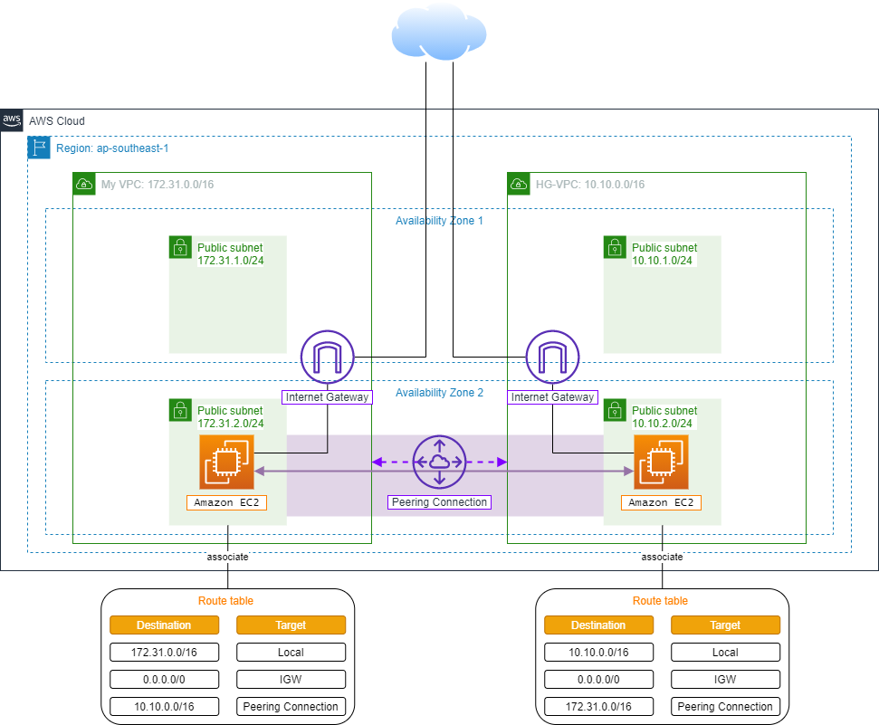
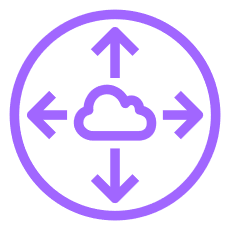

# Tổng quan

Theo mặc định, các VPC bên trong AWS Cloud là tách biệt và không thể giao tiếp trực tiếp với nhau. Ở bài thực hành này, bạn sẽ tiến hành thiết lập kết nối **VPC Peering** giữa hai VPC để các tài nguyên bên trong hai VPC đó có thể liên lạc trực tiếp với nhau. Nhờ vậy, các giao tiếp giữa hai VPC không cần phải thông qua Internet công cộng nữa, góp phần gia tăng tính bảo mật cho VPC.

Bạn sẽ tạo ra kiến trúc cho bài thực hành như sau:

## VPC Peering Connection

**VPC Peering Connection** là một kết nối mạng giữa 2 VPC cho phép bạn định tuyến traffic giữa chúng sử dụng địa chỉ private IPv4 hoặc IPv6. Những instance ở trong 1 trong 2 VPC có thể giao tiếp với nhau như chúng đang nằm cùng 1 mạng.

## VPC Peering
