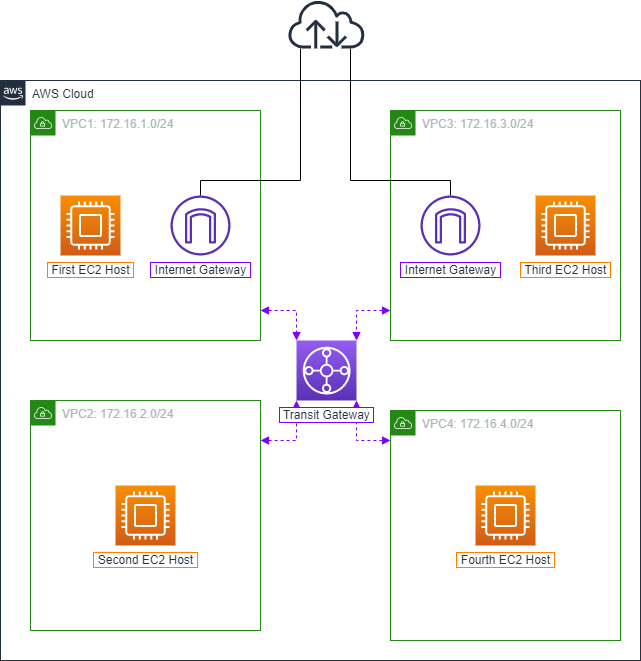
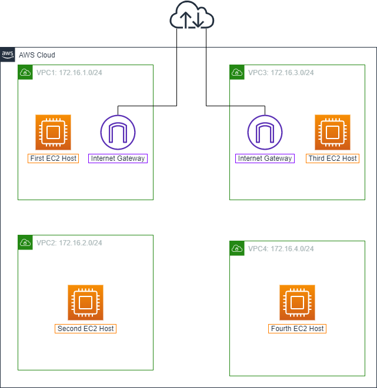
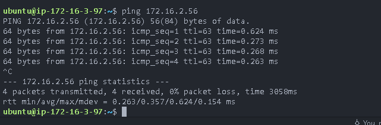

### Tổng quan
Ở bài lab này, bạn sẽ triển khai kiến trúc sau để kết nối bốn VPC với nhau qua AWS Transit Gateway:



### AWS Transit Gateway (AWS TGW)
Để giải quyết giới hạn của Peering Conenction, AWS Transite Gateway được dùng để kết nối các VPC và mạng on-premises thông qua một hub trung tâm. Điều này đơn giản hoá mạng và kết thúc các mối quan hệ định tuyến phức tạp. Nó hoạt động như một cloud router - mỗi kết nối mới chỉ thực hiện 1 lần.

### AWS Transit Gateway Attachment
AWS Transit Gateway Attachment là một công cụ để gán các subnet của từng VPC cần kết nối với nhau vào một TGW đã được khởi tạo. Transit Gateway Attachment hoạt động dựa trên quy mô của Availability Zone (AZ-level). Trong VPC, khi một subnet ở một AZ có Transit Gateway Attachment với một TGW, các subnet khác trong cùng AZ đều có thể kết nối tới TGW đó.

### Kiến trúc

Như vậy, tài nguyên được triển khai bao gồm:

- First EC2 Host ở VPC1 và Third EC2 Host ở VPC3 có thể được kết nối thông qua Internet.
- Second EC2 Host ở VPC2 và Fourth EC2 Host ở VPC4 không thể được kết nối thông qua Internet

#### Kiến trúc sau khi có transit gate_way


## Hướng dẫn triển khai Terraform


```bash
terraform init
terraform plan --var-file "terraform.tfvars"
terraform apply --var-file "terraform.tfvars"
```

## kết quả
